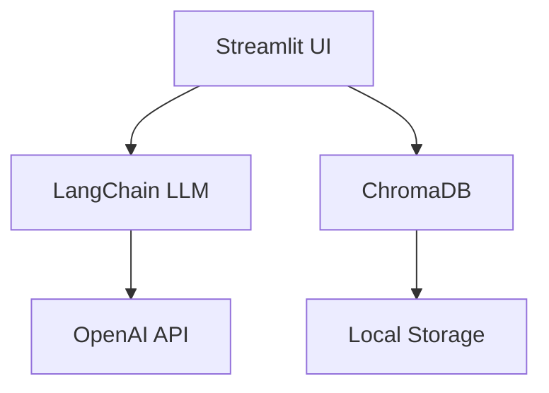

# HomeMatch - Intelligent Property Finder

*Last Updated: May 12, 2025*  
*Author: Prakhar Chandra*

## Table of Contents
1. [Project Overview](#1-project-overview)
2. [Key Features](#2-key-features)
3. [Technical Architecture](#3-technical-architecture)
4. [Installation Guide](#4-installation-guide)
5. [Usage Documentation](#5-usage-documentation)
6. [File Structure](#6-file-structure)
7. [Troubleshooting](#7-troubleshooting)
8. [API Reference](#8-api-reference)
9. [License](#9-license)

---

## 1. Project Overview

HomeMatch is an AI-powered real estate search platform that combines:
- **Natural language processing** for intuitive property searches
- **Vector database technology** for semantic matching
- **Personalized recommendations** based on user preferences

The system helps users find properties that truly match their needs by understanding both explicit filters and implicit preferences expressed in natural language.

## 2. Key Features

### Core Functionality
-  **Semantic Property Search**
  - Understands natural language queries like "modern home near parks with updated kitchen"
  - Combines keyword matching with contextual understanding
-  **Smart Property Recommendations**
  - Generates personalized highlights for each listing
  - Visual match scoring system (0-100%)
-  **Advanced Filtering**
  - Price range sliders
  - Bedroom/bathroom requirements
  - Neighborhood and property type selectors

### Data Management
-  **Persistent Vector Database**
  - ChromaDB storage of property embeddings
  - Automatic cache management
-  **Data Export**
  - JSON download of current listings
  - Plain text backup option

## 3. Technical Architecture

### System Diagram


## 4. Installation Guide
a. Prerequisites
        - Python 3.10 or later

        - OpenAI API key

        - pip package manager

b. Step-by-Step Setup
- Clone the repository

```bash
git clone https://github.com/yourusername/homematch.git
cd homematch
```
- Create virtual environment

```bash
python -m venv venv
source venv/bin/activate  # Linux/Mac
venv\Scripts\activate  # Windows
```
- Install dependencies

```bash
pip install -r requirements.txt
Configure environment
```

- Create .env file:
```ini
OPENAI_API_KEY=your_api_key_here
OPENAI_API_BASE=https://openai.vocareum.com/v1
```

- Initialize database

```bash
streamlit run main.py

```

## 5. Usage Documentation
a. Starting the Application
```bash
streamlit run main.py
```

b. User Interface Guide

- Search Interface

- Enter natural language description of desired property

- Adjust filters in sidebar

- Click "Find Matching Properties"

c. Results View

- Properties displayed as interactive cards

- Match scores indicate relevance

- Expandable details for each listing

d. Data Export

- Click "Export Current Listings"

- Download will begin automatically

e. Example Queries
"Family home with backyard in good school district"

"Modern condo with gym access under $500k"

"Historic home with character near downtown"

## 6. File Structure
homematch/
├── main.py                 # Primary application script
├── chroma_db/              # Vector database storage
├── .env                    # Environment configuration
├── requirements.txt        # Dependency list
├── property_listings.json  # Sample export
└── Listings.txt            # Text backup format


## 7. Troubleshooting
a. Common Issues
- Problem: Empty search results
Solution:

Stop the Streamlit server

Delete the chroma_db directory

Restart the application

- Problem: API connection errors
Solution:

Verify .env file contains correct API key

Check network connectivity

Confirm OpenAI service status

- Problem: Slow performance
Solution:

Reduce number of generated listings (edit n parameter)

Use more specific search queries

Upgrade hardware resources

## 8. API Reference
Key Functions

```python
def generate_property_listings(n: int = 150) -> List[Dict]:
    """Generate synthetic property listings
    Args:
        n: Number of listings to generate
    Returns:
        List of property dictionaries
    """
```
```python
def search_properties(query_text: str, filters: Dict = None) -> pd.DataFrame:
    """Semantic search with optional filters
    Args:
        query_text: Natural language search query
        filters: Dictionary of filter parameters
    Returns:
        DataFrame of matching properties
    """
```
